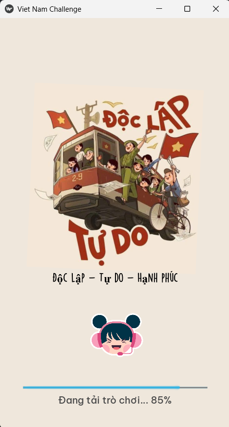
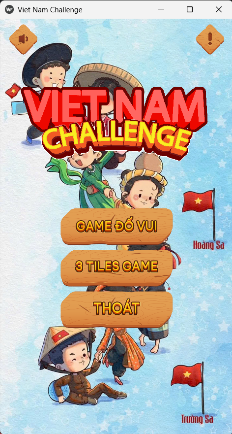
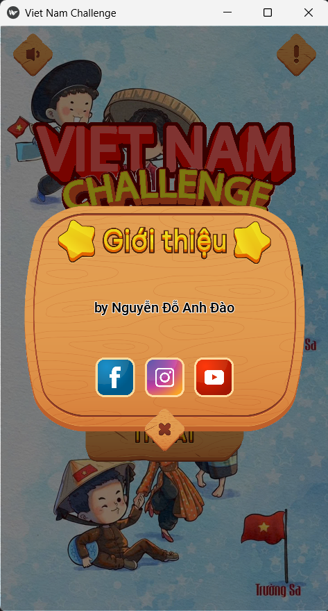
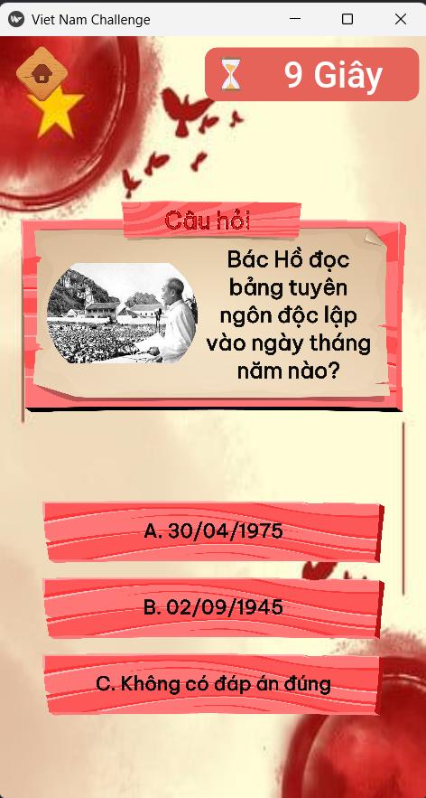
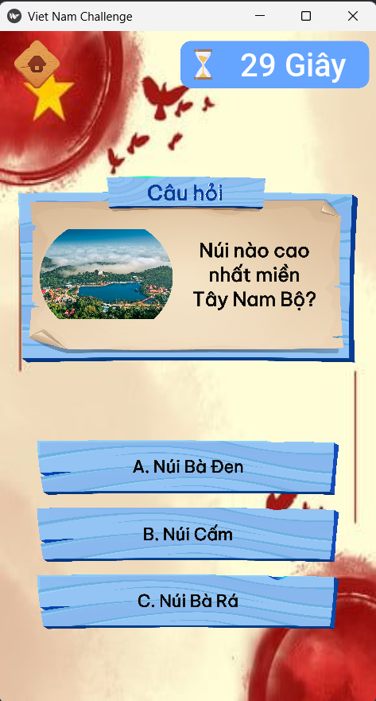
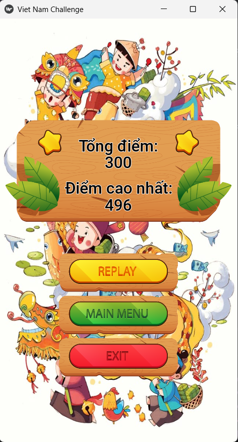
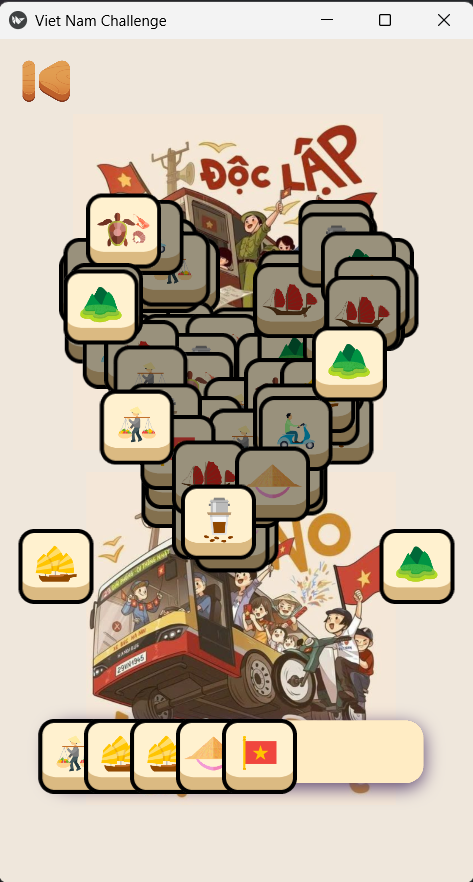

# 🎮 Vietnam Challenge - Python Game Project - Android

Một dự án trò chơi về thể loại **Puzzle** và **Casual Game** trên nền tảng Android, được phát triển bằng Python với **Kivy** và **KivyMD** trong môi trường PyCharm.

---

## 📹 Link video
- Link video demo: https://youtu.be/mjHlNSr0Ibs

---

## 🧰 Thông tin công nghệ sử dụng

### 🛠️ IDE & Ngôn ngữ
- **IDE**: PyCharm Community Edition `2025.1.1.1`
- **Ngôn ngữ**: Python `3.12.3`

### 📚 Thư viện & Framework
- **Kivy**: `2.3.1`
- **KivyMD**: `2.0.1.dev0`

---

## ⚙️ Cài đặt Kivy và KivyMD trong Pycharm
- **Lệnh cài Kivy:** `pip install kivy `
- **Lệnh cài KivyMD:** `pip install https://github.com/kivymd/KivyMD/archive/master.zip`

---

## 📹 Demo hình ảnh
 
 
 
 
 
